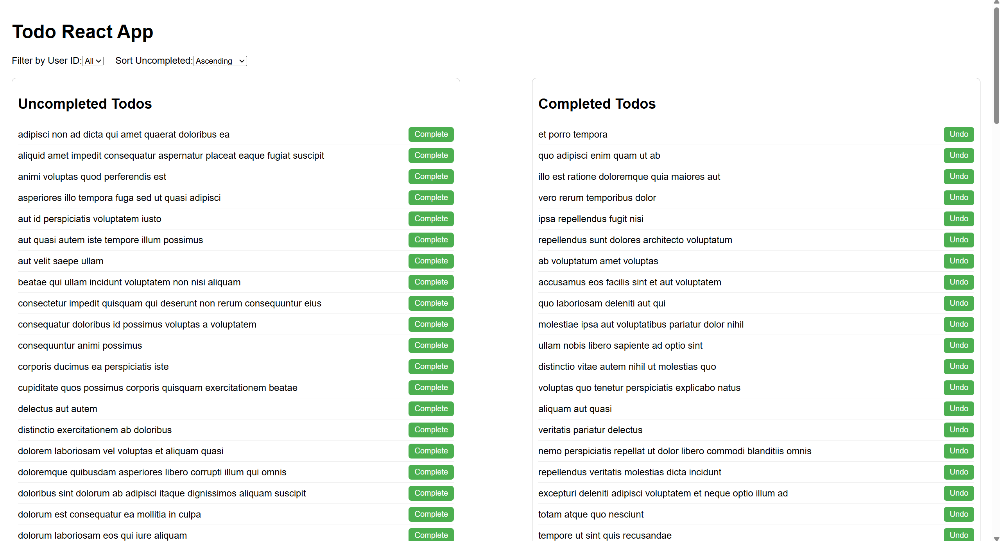

# todo_app_project
ToDo project with React (ТУ-София Практикум)
This is a simple todo app build with React and Vite.

# Screenshot of the application

# Prerequisites
Node js version - v22.15.0
npm version - 10.9.2

# Steps to install dependencies
npm install 

# Instructions on how to run the app locally
npm run dev

Then run the browser on adress http://localhost:5173/

